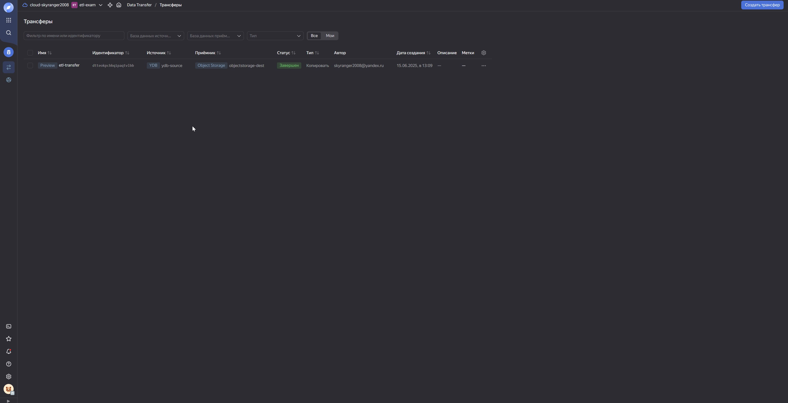
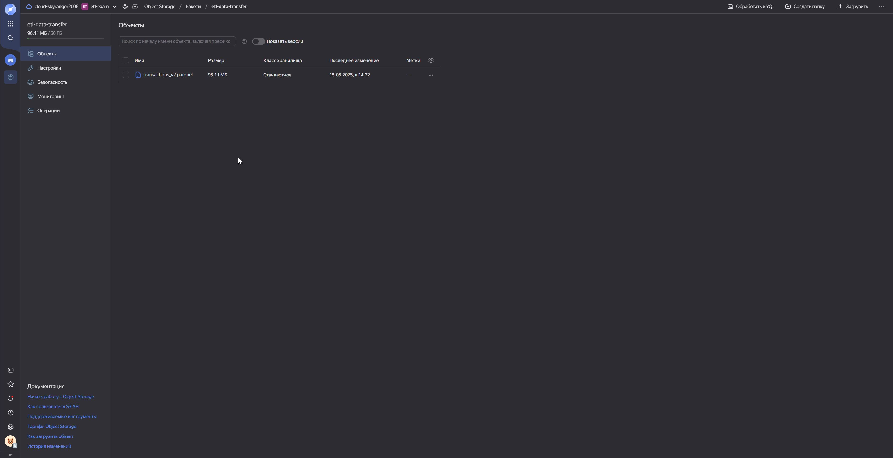

# 📝 Отчет по итоговому заданию ETL (4 модуль)

## 📦 Общая архитектура

- **Источник данных:** `transactions_v2.csv` (размещён в Object Storage Yandex Cloud)
- **ETL-пайплайн:** Airflow → Dataproc (PySpark) → Kafka → PostgreSQL (Managed Service)
- **Форматы:** CSV → Parquet → JSON → Kafka message → PostgreSQL

---

## 🔧 Компоненты пайплайна

### Задание 1. 🔄️ Работа с Yandex DataTransfer

- Вручную создана таблица в YDB
  <details>
    <summary>Тут SQL скрипт</summary>
  
    ### sql-скрипт создания таблицы в YDB
    ```sql
    CREATE TABLE transactions_v2 (
          msno Utf8,
          payment_method_id Int32,
          payment_plan_days Int32,
          plan_list_price Int32,
          actual_amount_paid Int32,
          is_auto_renew Int8,
          transaction_date Utf8,
          membership_expire_date Utf8,
          is_cancel Int8,
          PRIMARY KEY (msno)
      );
    ```
  </details> 
- В созданную таблицу с помощью CLI загружен датасет transaction_v2
  <details>
    <summary>Тут bash скрипт</summary>
  
    ### bash-скрипт загрузки датасета
    ```bash
    ydb  `
    --endpoint grpcs://ydb.serverless.yandexcloud.net:2135 `
    --database /ru-central1/b1g9tm1cvjc9r6hl0g83/etn4ciikjn2811hfpjo9 `
    --sa-key-file authorized_key.json `
    import file csv `
    --path transactions_v2 `
    --delimiter "," `
    --skip-rows 1 `
    --null-value "" `
    --verbose `
    transactions_v2.csv
    ```
  </details> 
- Создан трансфер данных с источником в YDB и приемником в Object Storage
  `s3a://etl-data-transform/transactions_v2.parquet`
    	<details>
    	<summary>Тут скриншоты</summary>
		- 
  		- 
  		- 
	</details> 

### Задание 2.  🖥️ Автоматизация работы с Yandex Data Processing при помощи Apache AirFlow

- Подготовлена инфраструктура (Managed service for Airflow)
- Создан DAG **DATA_INGEST**, который:
    - Создает Data Proc кластер.      
    - Запускает на кластере PySpark-задание для обработки Parquet-файла.
    - После завершения работы задания удаляет кластер.
  	<details>
    		<summary>Тут текст DAG</summary>
  
	 ### Data-proc-DAG.py
  
	 ```python
	    import uuid
		import datetime
		from airflow import DAG
		from airflow.utils.trigger_rule import TriggerRule
		from airflow.providers.yandex.operators.yandexcloud_dataproc import (
		    DataprocCreateClusterOperator,
		    DataprocCreatePysparkJobOperator,
		    DataprocDeleteClusterOperator,
		)
		
		# Данные вашей инфраструктуры
		YC_DP_AZ = 'ru-central1-a'
		YC_DP_SSH_PUBLIC_KEY = 'ssh-ed25519 AAAAC3NzaC1lZDI1NTE5AAAAIL7QzQcp0xQqFK6vEAo+hrKFwEWDYi9+ypctkf1LxcyE vasil@LES_PC'
		YC_DP_SUBNET_ID = 'e9btfqefvs4ved64rkg6'
		YC_DP_SA_ID = 'ajerrplc7q4nqek3211q'
		YC_DP_METASTORE_URI = '10.128.0.15'
		YC_BUCKET = 'etl-dataproc'
		
		# Настройки DAG
		with DAG(
		        'DATA_INGEST',
		        schedule_interval='@hourly',
		        tags=['data-processing-and-airflow'],
		        start_date=datetime.datetime.now(),
		        max_active_runs=1,
		        catchup=False
		) as ingest_dag:
		    # 1 этап: создание кластера Yandex Data Proc
		    create_spark_cluster = DataprocCreateClusterOperator(
		        task_id='dp-cluster-create-task',
		        cluster_name=f'tmp-dp-{uuid.uuid4()}',
		        cluster_description='Временный кластер для выполнения PySpark-задания под оркестрацией Managed Service for Apache Airflow™',
		        ssh_public_keys=YC_DP_SSH_PUBLIC_KEY,
		        service_account_id=YC_DP_SA_ID,
		        subnet_id=YC_DP_SUBNET_ID,
		        s3_bucket=YC_BUCKET,
		        zone=YC_DP_AZ,
		        cluster_image_version='2.1',
		        masternode_resource_preset='s2.small',  # минимальный ресурсный пресет
		        masternode_disk_type='network-hdd',
		        masternode_disk_size=32,  # уменьшенный размер диска
		        computenode_resource_preset='s2.small',  # уменьшенный ресурсный пресет
		        computenode_disk_type='network-hdd',
		        computenode_disk_size=32,  # уменьшенный размер диска
		        computenode_count=1,  # уменьшенное количество узлов
		        computenode_max_hosts_count=3,  # уменьшенное максимальное масштабирование
		        services=['YARN', 'SPARK'],
		        datanode_count=0,
		        properties={
		            'spark:spark.hive.metastore.uris': f'thrift://{YC_DP_METASTORE_URI}:9083',
		        },
		    )
	
	    # 2 этап: запуск задания PySpark
	    poke_spark_processing = DataprocCreatePysparkJobOperator(
	        task_id='dp-cluster-pyspark-task',
	        main_python_file_uri=f's3a://{YC_BUCKET}/scripts/clean-data.py',
	    )
	
	    # 3 этап: удаление кластера Yandex Data Processing
	    delete_spark_cluster = DataprocDeleteClusterOperator(
	        task_id='dp-cluster-delete-task',
	        trigger_rule=TriggerRule.ALL_DONE,
	    )
	
	    # Формирование DAG из указанных выше этапов
	    create_spark_cluster >> poke_spark_processing >> delete_spark_cluster```
		
</details> 
- Внутри скрипта-задания происходит загрузка, очистка и запись очищеных данных :
  - Приведение типов всех полей (`Integer`, `Boolean`, `Date`, `String`)
  - Удаление строк с пустыми значениями
  - Преобразование `transaction_date` и `membership_expire_date` из `yyyyMMdd` в `DateType`
- Результат сохраняется в формате Parquet:
  - `s3a://etl-data-transform/transactions_v2_clean.parquet`
  <details>
    <summary>Тут текст скрипта</summary>
  
	### clean-data.py
		  
	```python
		from pyspark.sql import SparkSession
		from pyspark.sql.functions import col, to_date
		from pyspark.sql.types import IntegerType, StringType, BooleanType
		from pyspark.sql.utils import AnalysisException
		
		
		# === Spark session ===
		spark = SparkSession.builder.appName("Parquet ETL with Logging to S3").getOrCreate()
		
		
		# === Пути ===
		source_path = "s3a://etl-data-source/transactions_v2.csv"
		target_path = "s3a://etl-data-transform/transactions_v2_clean.parquet"
		
		try:
		    print(f"Чтение данных из: {source_path}")
		    df = spark.read.option("header", "true").option("inferSchema", "true").csv(source_path)
		
		    print("Схема исходных данных:")
		    df.printSchema()
		
		    # Приведение типов + формат даты YYYYMMDD
		    df = df.withColumn("actual_amount_paid", col("actual_amount_paid").cast(IntegerType())) \
		           .withColumn("is_auto_renew", col("is_auto_renew").cast(BooleanType())) \
		           .withColumn("is_cancel", col("is_cancel").cast(BooleanType())) \
		           .withColumn("membership_expire_date", to_date(col("membership_expire_date").cast("string"), "yyyyMMdd")) \
		           .withColumn("msno", col("msno").cast(StringType())) \
		           .withColumn("payment_method_id", col("payment_method_id").cast(IntegerType())) \
		           .withColumn("payment_plan_days", col("payment_plan_days").cast(IntegerType())) \
		           .withColumn("plan_list_price", col("plan_list_price").cast(IntegerType())) \
		           .withColumn("transaction_date", to_date(col("transaction_date").cast("string"),  "yyyyMMdd"))
		
		    print("Схема преобразованных данных:")
		    df.printSchema()
		
		    # Удаление строк с пропущенными значениями
		    df = df.na.drop()
		
		    print("Пример данных после преобразования:")
		    df.show(5)
		
		    print(f"Запись в Parquet: {target_path}")
		    df.write.mode("overwrite").parquet(target_path)
		
		    print("✅ Данные успешно сохранены в Parquet.")

		except AnalysisException as ae:
		    print("❌ Ошибка анализа:", ae)
		except Exception as e:
		    print("❌ Общая ошибка:", e)
	
		spark.stop()
	```
  	</details> 
### Задание 3. 📤 Работа с топиками Apache Kafka® с помощью PySpark-заданий в Yandex Data Processing

- Создан кластер Data Proc, поднят Managed service for Kafka
- В Object Storage помещены скрипты:  
	- Скрипт `kafka-write.py`:
	  - Загружает данные из Parquet-файла с очищенными данными.
	  - Каждую секунду выбирает 100 случайных строк.
	  - Преобразует их в JSON.
	  - Отправляет в Kafka-топик `dataproc-kafka-topic`.
     		<details>
    		<summary>Тут текст скрипта</summary>
  
		### kafka-write.py
		  
		```python
		import time
		from pyspark.sql import SparkSession
		from pyspark.sql.functions import col, to_json, struct, rand
		
		def main():
		    spark = SparkSession.builder \
			.appName("parquet-to-kafka-loop-json") \
			.getOrCreate()

	    # Чтение parquet-файла
	    df = spark.read.parquet("s3a://etl-data-transform/transactions_v2_clean.parquet").cache()
	    total = df.count()
	    print(f"📦 Загружено {total} строк")
	
	    while True:
		# 100 случайных строк
		batch_df = df.orderBy(rand()).limit(100)
	
		# Преобразование в JSON
		kafka_df = batch_df.select(to_json(struct([col(c) for c in batch_df.columns])).alias("value"))
	
		# Отправка в Kafka
		kafka_df.write \
		    .format("kafka") \
		    .option("kafka.bootstrap.servers", "rc1a-sp0t812fps48sn74.mdb.yandexcloud.net:9091") \
		    .option("topic", "dataproc-kafka-topic") \
		    .option("kafka.security.protocol", "SASL_SSL") \
		    .option("kafka.sasl.mechanism", "SCRAM-SHA-512") \
		    .option("kafka.sasl.jaas.config",
			    "org.apache.kafka.common.security.scram.ScramLoginModule required "
			    "username=\"user1\" "
			    "password=\"password1\";") \
		    .save()

	        print("✅ Отправлено 100 сообщений в формате JSON в Kafka")
	        time.sleep(1)
	
	    	spark.stop()
	
		if __name__ == "__main__":
		    main()
	    	```
	</details>
   
	- Kafka использует:
	  - Протокол: `SASL_SSL`
	  - Механизм: `SCRAM-SHA-512`

### 3. 📥 Чтение из Kafka и запись в PostgreSQL

- Стриминговое приложение на PySpark:
  - Читает сообщения из Kafka.
  - Десериализует JSON.
  - Преобразует даты.
  - Пишет в таблицу PostgreSQL `transactions_stream` с помощью `.foreachBatch()`.

---

## 📊 Визуализация в Yandex DataLens

**Настройки фильтрации:**
- 🔍 Фильтр по полю `msno`
- 📅 Сортировка по дате транзакции (сначала новые)

### 🔹 Дашборды и чарты

| Название чартa             | Источник        | Автор          | Дата     | Описание                                          |
|----------------------------|------------------|----------------|----------|---------------------------------------------------|
| 💳 Методы оплаты по сумме  | kafka-stream     | skyranger2008  | 15.06.25 | Топ-10 payment_method_id по `actual_amount_paid` |
| 📆 Сумма по месяцам         | kafka-stream     | skyranger2008  | 15.06.25 | Группировка по `transaction_date`, сумма         |
| 📆 Количество по месяцам    | kafka-stream     | skyranger2008  | 15.06.25 | Кол-во транзакций по месяцам                      |
| 🧾 Методы оплаты            | kafka-stream     | skyranger2008  | 15.06.25 | Распределение по `payment_method_id`             |

---

## ✅ Результаты выполнения

- ✅ Файл CSV успешно загружен, очищен, сохранён в Parquet
- ✅ Kafka-топик получает данные в режиме реального времени
- ✅ PostgreSQL таблица наполняется через стриминг из Kafka
- ✅ Данные визуализированы в Yandex DataLens
